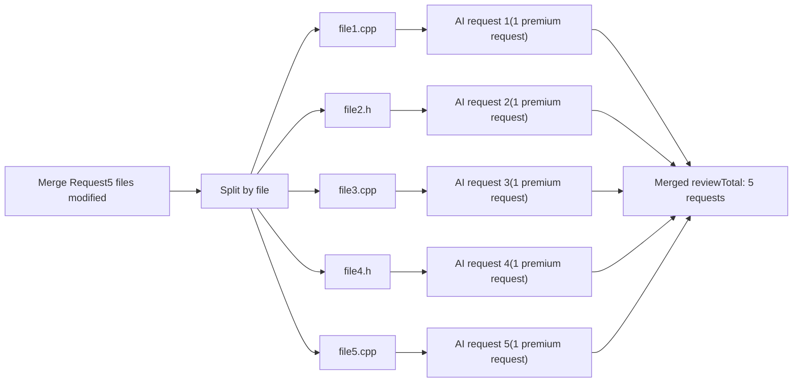
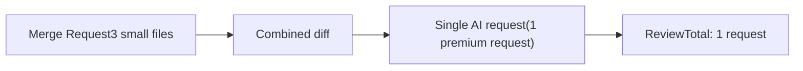
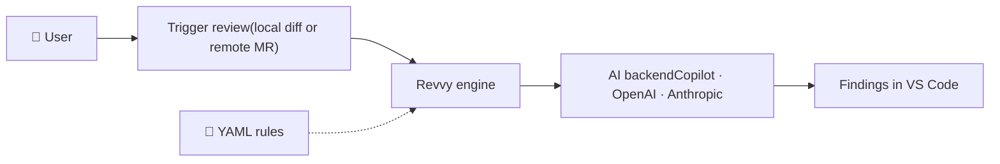

<p align="center">
  
  <br />
  <br />
  <a href="https://marketplace.visualstudio.com/items?itemName=YonK0.revvy-reviewer">
    
  </a>
  <a href="./LICENSE">
    
  </a>
  <a href="https://github.com/YonK0/revvy/actions/workflows/ci.yml">
    
  </a>
</p>

# <p align="center"></p>
<p align="center"><strong>Code review that knows your rules.</strong></p>

---

## What is it?

Revvy is a VS Code extension that brings structured, AI-powered code review directly into your editor. Instead of generic AI feedback, it enforces a set of rules you define in YAML — tailored to your team's standards, domain, or industry requirements (e.g. safety-critical embedded C/C++, Python, and more).

> *Why not just use `/review` or type a prompt?*

- Many developers are not good at writing prompts.
- Every review requires crafting a new prompt tailored to a specific tech stack or language.
- AI can't deliver a thorough review without specific rules or best practices — the kind that are usually defined at the company or team level.
- Rules vary from one developer to another, which is why Revvy uses hardcoded, shared rules stored in a single YAML file that the whole team uses.
- A clean UI that shows you the exact line of code with an inline comment when an issue or warning is detected.

**That's all?**

Not quite. Revvy also:

- Reviews multiple GitHub PRs and GitLab MRs in a single pass using MCP
- Validates your code against Jira ticket requirements — so nothing slips out of scope
- Generates integration tests (functional + regression)
- Provides a **Copy as Markdown** button that copies all review comments along with a ready-to-use prompt — paste it into your favorite AI assistant (ChatGPT, Claude, Copilot, etc.) to fix every issue in one shot
- *(Coming soon)* **Auto-comment on PRs/MRs** — Revvy posts a comment on the pull/merge request stating it has been reviewed by the tool, with a summary of findings for reviewers and maintainers to see at a glance

> **It works with the AI backend you already have** — GitHub Copilot (no extra key needed), OpenAI GPT-4o, or Anthropic Claude — with automatic fallback.

---

## Why Revvy over other tools?

| | Revvy | Generic AI prompt (Copilot Chat, etc.) | Paid review tools |
|---|---|---|---|
| Rule-driven, team-shared standards | Yes — YAML profiles in your repo | No — prompt varies per developer | Partial — cloud-managed rules |
| Works with your existing AI subscription | Yes — Copilot, OpenAI, Anthropic | Yes | No — separate subscription |
| Embedded / safety-critical profiles | Yes — C/C++, Yocto, MISRA-style rules | No | No |
| Multi-repo PR/MR in one pass | Yes — GitHub + GitLab via MCP | No | Partial |
| Cost | Free & open-source | Included in your AI plan | Paid |
---

## Review Modes

Revvy offers two review modes you can toggle in the panel. Each is optimized for a different MR shape.

### Per File mode (default)

Each file is reviewed in its own AI request, in parallel. Use for **complex MRs** with many files or substantial changes.



**What it solves:** focused attention per file, no context dilution, no output truncation. Each finding is reasoned about with the full attention budget of the model.

**Cost:** higher — N requests for N files. Best quality on complex MRs.

### All in One mode

The entire MR is sent to the AI in a single request. Use for **small MRs** (under ~5 files / ~300 lines of diff).



**What it solves:** lower quota consumption when the MR is small enough that focused per-file attention isn't necessary. Useful for small fixes, opcode additions, or single-feature changes.

**Cost:** 1 request total. May miss findings on larger MRs.

> Use **All in One** for small MRs (under ~5 files / ~300 lines of diff).
> Use **Per File** for larger or complex MRs.

## Demo


## Quick Start


**From the VS Code Marketplace:**

Search for `Revvy` in the VS Code Extensions panel and install it.


**From source:**
```bash
git clone https://github.com/YonK0/revvy.git
cd revvy
npm install
npm run compile
# Press F5 in VS Code to launch the Extension Development Host
```

Once installed, click the **Revvy** icon in the Activity Bar. Three example profiles are created automatically on first use (`c-embedded`, `yocto`, `python`).

---

## Writing Rule Profiles

Create `.yaml` files in `.vscode-reviewer/profiles/`. Rules are reloaded automatically on save.

```yaml
profile:
  id: my-team
  label: "My Team Rules"
  version: "1.0.0"
  file_patterns:
    - "**/*.ts"

  rules:
    - id: NO_CONSOLE_LOG
      title: "No console.log in production code"
      category: "coding-standards"
      severity: warning      # error | warning | info
      enabled: true
      description: |
        console.log statements should not be merged to main.
        Use a structured logger instead.
```

See the bundled profiles in `.vscode-reviewer/profiles/` for full examples.

---

## MCP Servers (Optional)

Enables Jira ticket fetching and multi-repo PR/MR review. Copy `.vscode/mcp.json` and fill in your credentials — tokens are prompted at runtime and never stored on disk.

| Server | Install | Used for |
|---|---|---|
| GitHub | Docker | Fetch PR diffs for multi-repo review |
| GitLab | `npm i -g @modelcontextprotocol/server-gitlab` | Fetch MR diffs |
| Atlassian | `pip install mcp-atlassian` | Fetch Jira ticket requirements |

---

## Requirements

- VS Code `1.96.0`+
- Git in `PATH`
- One of: GitHub Copilot subscription or free tier / OpenAI API key / Anthropic API key

---

## Architecture


# Code Architecture
```
src/
├── extension.ts      # Entry point — commands, WebView provider, YAML watcher
├── panelProvider.ts  # WebView UI — welcome, loading, results screens
├── reviewer.ts       # Core engine — prompt construction, AI call, response parsing
├── aiBackend.ts      # AI abstraction — Copilot, OpenAI, Anthropic + fallback chain
└── ruleLoader.ts     # YAML loader — file scanning, parsing, live-reload watcher
```

---

## Contributing

Contributions are welcome — new rule profiles, AI backends, bug fixes, UI improvements. See [CONTRIBUTING.md](./CONTRIBUTING.md).

---
